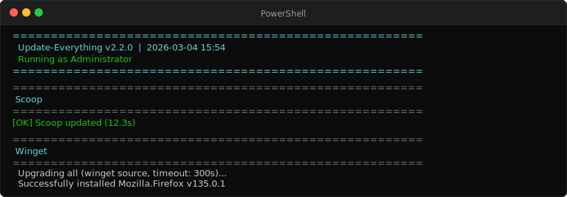
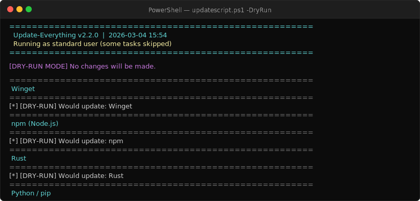
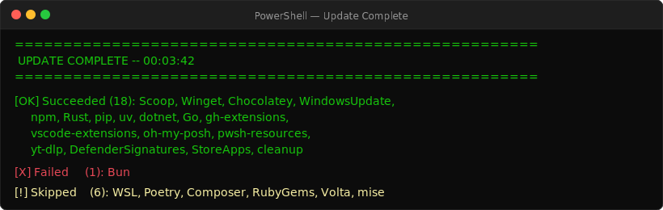

# updateEverything



A single PowerShell script that keeps your entire Windows machine up to date — package managers, system components, and dev toolchains — in one run.





## Quick start

```powershell
# Run from the script directory. Admin rights give the full experience.
.\updatescript.ps1

# Auto-elevate to admin if not already elevated
.\updatescript.ps1 -AutoElevate

# Preview what would be updated without making any changes
.\updatescript.ps1 -DryRun

# Fast run: skips slower managers (Chocolatey, pip, npm, Rust, etc.)
.\updatescript.ps1 -FastMode
```

## What it updates

| Category | Tools |
|----------|-------|
| Package managers | Winget, Scoop, Chocolatey |
| System | Windows Update, Microsoft Store apps, WSL distros, Windows Defender signatures |
| JavaScript | npm, pnpm, yarn, bun, deno |
| Python | pip, pipx, uv, uv tools, Poetry |
| Systems languages | Rust + cargo binaries, Go |
| .NET | dotnet tools, dotnet workloads |
| Other runtimes | Flutter, Ruby gems, Composer |
| Dev tools | VS Code extensions, GitHub CLI extensions, git-lfs |
| AI | Ollama models when `-UpdateOllamaModels` is supplied |
| Cleanup | Temp files, DNS cache, Recycle Bin, optional DISM component cleanup |

## Speed modes

| Mode | What it skips |
|------|---------------|
| *(default)* | Optional Ollama model pulls; admin-only tasks still require elevation |
| `-FastMode` | Chocolatey, WSL distros, npm, pnpm, bun, deno, Rust, Go, pip, uv, VS Code extensions, PowerShell modules, and more slow steps |
| `-UltraFast` | Everything FastMode skips + Windows Update, Store apps, WSL, cleanup |

## DryRun and WhatChanged

`-DryRun` prints every action the script would take without executing anything — useful for reviewing before a first run or after changes.

`-WhatChanged` shows a summary of what was actually updated at the end of the run — helpful for changelogs or audit logs.

```powershell
.\updatescript.ps1 -DryRun
.\updatescript.ps1 -WhatChanged
```

## Configuration file

Drop an `update-config.json` next to the script to customize behavior without command-line flags:

```json
{
  "WingetSkipPackages": ["Microsoft.VisualStudio.BuildTools"],
  "PipSkipPackages": ["some-pinned-package"],
  "PipIgnoreHealthPackages": ["internal-package"],
  "WingetTimeoutSec": 600,
  "LogRetentionDays": 14
}
```

Supported keys mirror the `$script:Config` hashtable in the script. Any key set here overrides the default.

## Scheduled daily runs

```powershell
# Register a Windows Scheduled Task to run at 3 AM daily (requires admin)
.\updatescript.ps1 -AutoElevate -Schedule -ScheduleTime "03:00"
```

The scheduled task runs with `-SkipReboot -NoPause -SkipWSL -SkipWindowsUpdate` so it completes unattended.


## All parameters

| Parameter | Description |
|-----------|-------------|
| `-DryRun` | Show what would run, make no changes |
| `-WhatChanged` | Print summary of updates at end |
| `-AutoElevate` | Re-launch as Administrator automatically |
| `-NoElevate` | Force run without elevation (some steps skipped) |
| `-FastMode` | Skip slow optional tools |
| `-UltraFast` | Skip everything FastMode does + system tasks |
| `-NoPause` | Don't wait for keypress at end |
| `-SkipWindowsUpdate` | Skip Windows Update |
| `-SkipReboot` | Never prompt to reboot |
| `-SkipDestructive` | Skip actions that modify system state |
| `-SkipWSL` | Skip WSL update |
| `-SkipWSLDistros` | Skip updating WSL distros |
| `-SkipDefender` | Skip Defender signature update |
| `-SkipStoreApps` | Skip Microsoft Store app updates |
| `-SkipNode` | Skip Node.js ecosystem (npm, pnpm, yarn, bun, deno) |
| `-SkipRust` | Skip Rust + cargo binaries |
| `-SkipGo` | Skip Go |
| `-SkipFlutter` | Skip Flutter |
| `-SkipGitLFS` | Skip git-lfs |
| `-SkipUVTools` | Skip uv tool upgrade |
| `-SkipVSCodeExtensions` | Skip VS Code extension updates |
| `-SkipPoetry` | Skip Poetry |
| `-SkipComposer` | Skip Composer |
| `-SkipRuby` | Skip Ruby gems |
| `-SkipPowerShellModules` | Skip PowerShell module updates |
| `-SkipCleanup` | Skip all cleanup steps |
| `-DeepClean` | Run extra cleanup with DISM component cleanup and Delivery Optimization cache cleanup |
| `-UpdateOllamaModels` | Pull updates for installed Ollama models; skipped by default |
| `-Schedule` | Register as a daily scheduled task |
| `-ScheduleTime` | Time for scheduled task (default: `03:00`) |
| `-LogPath` | Custom log file path |
| `-JsonSummaryPath` | Custom JSON summary path |
| `-StateDir` | Custom state directory for logs and summaries |
| `-WingetTimeoutSec` | Winget task timeout in seconds (default: 600) |
| `-TaskTimeoutSec` | Default per-task timeout in seconds (default: 1800) |
| `-OllamaTimeoutSec` | Per-command Ollama timeout in seconds (default: 600) |
| `-ParallelThrottle` | Max parallel jobs 0–16; 0 auto-selects from CPU count |
| `-RetryCount` | Task retry count for transient failures (default: 1) |
| `-Only` | Run only matching task names, categories, or tags |
| `-Skip` | Skip matching task names, categories, or tags |
| `-ListTasks` | Show planned/skipped tasks and write a summary |
| `-SelfTest` | Run a minimal internal task through the scheduler |

## Requirements

- Windows 10 or 11
- PowerShell 7+ recommended (falls back to Windows PowerShell 5.1)
- Administrator rights recommended for full functionality
- `PSWindowsUpdate` module for Windows Update (`Install-Module PSWindowsUpdate`)

## Helper scripts

| Script | Purpose |
|--------|---------|
| `fix_installer.ps1` | Repairs broken Windows Installer (MSI) source cache entries |
| `force_reinstall.ps1` | Force-reinstalls a winget package when normal upgrade fails |

## License

MIT. See [LICENSE](LICENSE).

---

See [CHANGELOG.md](CHANGELOG.md) for version history.
